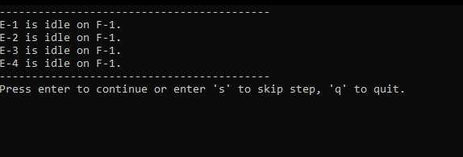
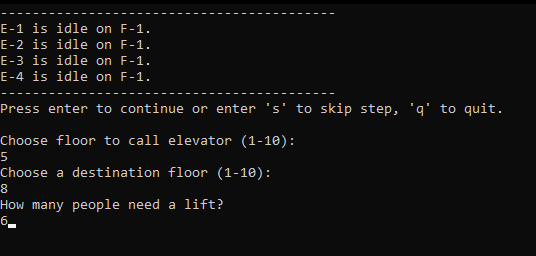
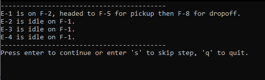
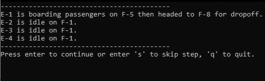
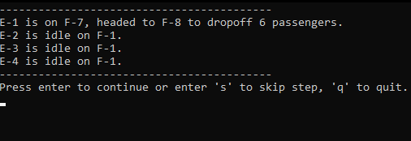
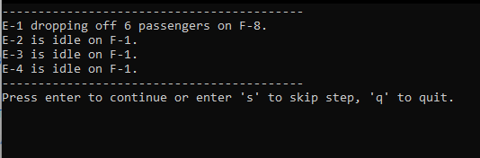
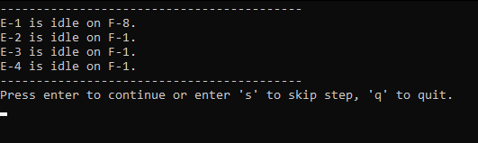

# Simple Elevatur Simulation
This solution simulates the behaviour of elevators picking up and transporting passengers to other floors.
The logic behind the elevators is simplistic and doesn't currently support queuing (application constraints listed in "Constraints" section below).

## Dependencies
Built with .NET 7.

## Getting Started
Open the solution using Visual Studio, VS Code or any editor that has .NET tooling support.

There are 2 projects, the ConsoleApp and Unit Tests. Ensure the ConsoleApp project is set as the startup project.

Either run the project via IDE or by terminal with the following command in the DVT.Elevator.ConsoleApp directory:

```
dotnet run
```

## Using The App
1. Once running the application, we're presented with information about the 4 elevators and a prompt to provide instructions. Note that the simulation works in a "time step" per instruction. A single time step is equivalent to onboarding/offboarding passengers or moving a floor up/down (depending on the pickup and destination floor).

<div align="center">
    
</div>

2. Next we provide a set of instructions, in this example, we want to call an elevator to floor 5 to pickup 6 passengers then drop them off at floor 8.
<div align="center">
    
</div>

3. After entering the instructions, the first elevator is chosen and heads to floor 5 for pickup.
<div align="center">
    
</div>

4. Once the elevator reaches the pickup floor, it begins boarding passengers.
<div align="center">
    
</div>

5. It then proceeds to the destination floor.
<div align="center">
    
</div>

6. Once reaching the destination floor, begins offboarding passengers.
<div align="center">
    
</div>

7. The elevator is now idle and awaits further instructions.
<div align="center">
    
</div>

## Constraints
There are some constraints with this simulation, notably:

1. You can only load up to a max of 14 passengers per instruction. There is a weight limit of 7 per elevator, and if the awaiting passengers on the floor exceeds 7, it will automatically choose the next available elevator to pickup the remaining passengers.
2. You cannot call an elevator if they're all in motion.
3. You can only instruct a single pickup and single destination. In other words, there's no queuing logic for the set of elevators.

## Notes On Application Design
The specification mentions to stick to OOP principles and this section will outline the reasoning behind how the application is built.

The approach taken is to stick to the requirements and not over-engineer the solution. As we have very distinct types of objects, I did not feel the need to introduce any abstract classes since there's no shared behaviour. Further to this, we do not have a good use case just yet for liskov's substitution principle as we don't have subclasses.

We use interfaces to clearly define the functions and properties that can be expected, in this case, for the Elevator Orchestrator, the Floor and the Elevator. With the interfaces, we adhere to the open-close principle by allowing future potential new types of orchestrators, floors and elevators that can be used in the Building class.

In the main method of the Program.cs file, we instantiate the elevators and the orchestrator, providing these to the Building class, which is true to the real world in that, arguably, during the construction of the building, there's an external provider that will manufacture the elevators and "provide it" to the Building, which sticks to the dependency inversion principle. Once the building is instantiated, it will instantiate floors and provide this to the elevator orchestrator so it has an awareness of which floors elevators can go to.

Lastly on the SOLID principles front, each class sticks to its own responsibilities, adhering to single responsibility.

Notably on the OOP side, there's clear encapsulation on the Floor, Elevator and ElevatorOrchestrator classes, only providing access to certain properties that needs to be externally exposed as well as protecting its invariance through public methods that change its internal state. This is particularly important as we need to maintain consistency and integrity of these objects state over time. 

As mentioned above, there's no sub-classing here, so there's no good example of Inheritance being used here, however we are using Polymorphism by way of Interfaces which enables us to create generic contracts for our classes to use, allowing for future additions of new types without modifying excessive amounts of code, hence achieving loose coupling.

## Unit Tests
Some basic surface level unit tests were implemented, which covers a few cases of passenger counts being correctly updated as we're instructing elevators around floors as well as the basic behaviour of elevators being optimally chosen (given the constraints).

A TDD approach was not taken as this was not a requirement in the specifications. However,
if one were to begin using TDD moving forward, a good set of unit tests to write next would be to cover the behaviour of queuing and the associated logic. The unit tests would fail first, then the relevant classes would be updated along with the logic to pass the unit tests.

Built with xUnit for no particular reason.